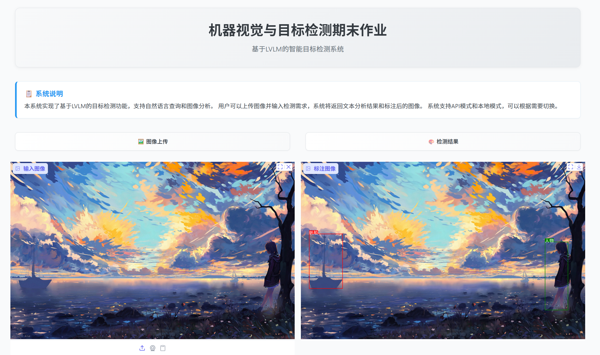

# LVLM目标检测系统

广西大学机器视觉与目标检测期末作业。

一个基于大型视觉语言模型(LVLM)的目标检测系统，支持自然语言查询和图像分析。

## 项目概述

本项目实现了一个结合计算机视觉和自然语言处理的目标检测系统。

系统可以根据用户的自然语言查询，智能识别和定位图像中的物体，并提供分析报告。



### 核心组件

- **前端界面**：基于Gradio构建的交互式Web界面
- **检测引擎**：处理图像分析和目标检测的核心逻辑
- **LVLM模型**：支持API调用和本地部署两种模式
- **标注工具**：将检测结果可视化呈现在图像上

## 安装指南

### 环境说明

**本地推理**
- Python 3.12
- CUDA 12.4
- GPU RTX 4090(24GB) * 1
- CPU 16 vCPU Intel(R) Xeon(R) Platinum 8352V CPU @ 2.10GHz
- 内存 120GB

**训练模型**
- Python 3.12
- CUDA 12.4
- GPU A100-PCIE-40GB * 2
- CPU 20 vCPU Intel Xeon Processor (Skylake, IBRS)
- 内存 144GB

### 安装步骤

1. 克隆仓库
```bash
git clone https://github.com/Xenos2104/Object-Detection-LVLM.git
cd Object-Detection-LVLM
```

2. 安装依赖
```bash
pip install -r requirements.txt
```

3. 配置环境变量

编辑.env文件，填入API密钥
```bash
cp .env.example .env
```

4. 下载本地模型*
```bash
modelscope download --model Qwen/Qwen2.5-VL-3B-Instruct
```

## 使用说明

### 启动系统

```bash
python app.py
```

系统将在 http://127.0.0.1:7860 启动，可通过浏览器访问。

### API/本地模型
- **API模式**：需要网络连接，使用API服务
- **本地模式**：需要GPU支持，使用本地模型

## 项目结构
```
.
├── app.py                # 主应用程序
├── config.py             # 配置文件
├── prompt.py             # 提示模板
├── utils.py              # 工具函数
├── requirements.txt      # 依赖列表
├── core/                 # 核心功能
│   ├── __init__.py
│   ├── detect.py         # 检测逻辑
│   └── annotate.py       # 图像标注
├── service/              # 服务接口
│   ├── __init__.py
│   ├── api.py            # API模式
│   └── local.py          # 本地模式
├── model/                # 模型文件夹
└── finetune/              # 微调相关
```

## 系统说明

### 使用的模型

- **API模式**：Qwen2.5-VL-72B-Instruct
- **本地模式**：Qwen2.5-VL-3B-Instruct-X（微调）

### 检测流程

1. 图像预处理和大小调整
2. 构建提示和查询
3. 模型推理（API或本地）
4. 解析JSON响应
5. 在图像上标注检测结果
6. 视觉问答

## 常见问题

### 系统报错"模型加载失败"？
请确保已下载并训练正确的模型文件，并检查GPU内存是否足够。

### API模式无法连接？
请检查网络连接和API密钥是否正确配置。

## 许可证
本项目采用MIT许可证 - 详见 [LICENSE](LICENSE) 文件
